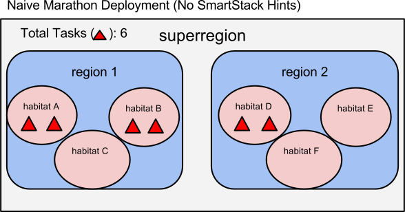
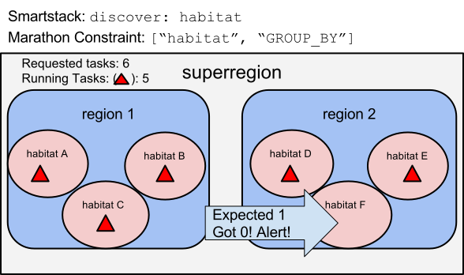
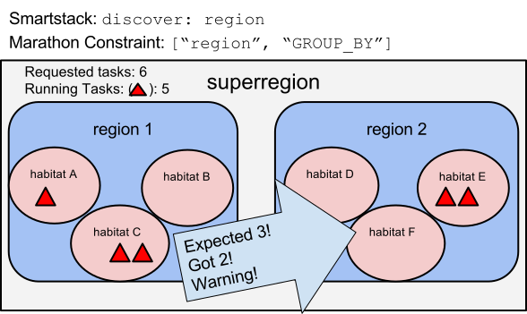

How PaaSTA Interacts with SmartStack
====================================

PaaSTA uses SmartStack configuration to influence the **deployment** and
**monitoring** of services. This document assumes some prior knowledge
about SmartStack; see http://nerds.airbnb.com/smartstack-service-discovery-cloud/.

.. contents:: Table of Contents
   :depth: 2

How SmartStack Settings Influence Deployment
--------------------------------------------

In SmartStack, a service can be configured to be *discovered* at a particular
latency zone.

At Yelp, we give names to these latency zones like this:

.. image:: discovery_settings.svg
   :width: 700px

The ``discover:`` key in smartstack sets the scope at which individual
tasks can be discovered and load balanced to. For example, a setting
of ``discover: superregion`` would discover one large pool of tasks for
use, regardless of which region or habitat they are in. (great for availability)
e.g. A service in habitat A will make requests of a service in any of habitats
A-F. This is great for availability -- six habitats to try -- but may introduce
latency if communications are slow between region 1 and region 2.

As another example, a setting of ``discover: habitat`` would make it so only
the tasks in a particular habitat are discover-able by the clients in that
habitat. (great for latency)
e.g. A service in habitat A will make requests of a service only in habitats
A-C. This is great for latency -- only talk to habitats that are
topographically "nearby" -- but reduces availability since only three habitats
can be reached.

What Would Happen if PaaSTA Were Not Aware of SmartStack
^^^^^^^^^^^^^^^^^^^^^^^^^^^^^^^^^^^^^^^^^^^^^^^^^^^^^^^^

PaaSTA uses `Kubernetes <https://kubernetes.io/>`_ to deploy
long-running services. At Yelp, PaaSTA clusters are deployed at the
``superregion`` level. This means that a service could potentially be deployed
on any available host in that ``superregion`` that has resources to run it. If
PaaSTA were unaware of the Smartstack ``discover:`` settings, Kubernetes scheduler would
naively deploy pods in a potentially "unbalanced" manner:

With the naive approach, there is a total of six pods for the superregion, but
four landed in ``region 1``, and two landed in ``region 2``. If
the ``discover`` setting were set to ``habitat``, there would be habitats
**without** pods available to serve anything, likely causing an outage.

In a world with configurable SmartStack discovery settings, the deployment
system (Kubernetes) must be aware of these and deploy accordingly.

How to set PaaSTA to be aware of SmartStack
^^^^^^^^^^^^^^^^^^^^^^^^^^^^^^^^^^^^^^^^^^^^^

PaaSTA is not natively aware of SmartStack, to make it aware or more specifically Kubernetes scheduler aware, we can use Pod Topology Spread Contraints.
To balance pods across Availability Zones (AZs) in Kubernetes, we use `topology spread contraints <https://kubernetes.io/docs/concepts/scheduling-eviction/topology-spread-constraints/>`_. By using the key
"topology_spread_constraints" in soa-configs to assign it for each instance of a service.

How SmartStack Settings Influence Monitoring
--------------------------------------------

If a service is in SmartStack, PaaSTA uses the same ``discover`` setting
referenced above to decide how the service should be monitored. When a service
author sets a particular setting, say ``discover: region``, it implies that the
system should enforce availability of that service in every region. If there
are regions that lack tasks to serve that service, then PaaSTA should alert.

Example: Checking Each Habitat When ``discover: habitat``
^^^^^^^^^^^^^^^^^^^^^^^^^^^^^^^^^^^^^^^^^^^^^^^^^^^^^^^^^

If SmartStack is configured to ``discover: habitat``, PaaSTA configures
Kubernetes to balance tasks to each habitat. But what if it is unable to do that?

In this case, there are no tasks in habitat F. This is a problem because
``discover: habitat`` implies that any clients in habitat F will not
be able to find the service. It is *down* in habitat F.

To detect and alert on this, PaaSTA uses the ``discover`` setting to decide
which unique locations to look at (e.g. ``habitat``). Paasta iterates over
each unique location (e.g. habitats A-F) and inspects the replication levels
in each location. It finds that there is at least one habitat with too few
instances (habitat F, which has 0 out of 1) and alerts.

The output of the alert or ``paasta status`` looks something like this::

    Smartstack:
        habitatA - Healthy - in haproxy with (1/1) total backends UP in this namespace.
        habitatB - Healthy - in haproxy with (1/1) total backends UP in this namespace.
        habitatC - Healthy - in haproxy with (1/1) total backends UP in this namespace.
        habitatD - Healthy - in haproxy with (1/1) total backends UP in this namespace.
        habitatE - Healthy - in haproxy with (1/1) total backends UP in this namespace.
        habitatF - Critical - in haproxy with (0/1) total backends UP in this namespace.

In this case the service authors have a few actions they can take:

- Increase the total instance count to have more tasks per habitat.
  (In this example, each habitat contains a single point of failure!)
- Change the ``discovery`` setting to ``region`` to increase availability
  at the cost of latency.
- Investigate *why* tasks can't run in habitat F.
  (Lack of resources? Improper configs? Missing service dependencies?)

Example: Checking Each Region When ``discover: region``
^^^^^^^^^^^^^^^^^^^^^^^^^^^^^^^^^^^^^^^^^^^^^^^^^^^^^^^

If SmartStack is configured to ``discover: region``, PaaSTA configures
Kubernetes to balance tasks to each region. But what if it is unable to launch
all the tasks, but there were tasks running in that region?

The output of the alert or ``paasta status`` looks something like this::

    Smartstack:
        region1 - Healthy - in haproxy with (3/3) total backends UP in this namespace.
        region2 - Warning - in haproxy with (2/3) total backends UP in this namespace.

Assuming a threshold of 50%, an alert would not be sent to the team in this case.

Even if some habitats do not have tasks for this service, ``discover: region``
ensures that clients can be satisfied by tasks in the same region if not by
tasks in the same habitat.

The Relationship Between Nerve "namespaces" and PaaSTA "instances"
------------------------------------------------------------------

Example: One-to-one Mapping
^^^^^^^^^^^^^^^^^^^^^^^^^^^

SmartStack's Nerve component can be configured to advertise different
components of the same service on different ports. In PaaSTA we call these
"Nerve namespaces". Here is an example of a service with two namespaces::

    #smartstack.yaml
    main:
        proxy_port: 20001
    api:
        proxy_port: 20002

The corresponding Kubernetes configuration in PaaSTA might look like this::

    #kubernetes.yaml
    main:
       instances: 10
       cmd: myserver.py
    api:
       instances: 3
       cmd: apiserver.py

In this way, a service can provide two different "modes", while using the same
codebases. Here there is a one-to-one mapping between the "Nerve namespaces" and
the "PaaSTA instances". By default the PaaSTA will advertise a service under the
Nerve namespace with the *same name* as the instance.

Example: Canary
^^^^^^^^^^^^^^^

However, there are situations where you would like to pool instances together under
the same Nerve namespace. Consider this example::

    #smartstack.yaml
    main:
        proxy_port: 20001

    #kubernetes.yaml
    main:
        instances: 10
        cmd: myserver.py
    canary:
        instances: 1
        registrations: ['service.main']
        cmd: myserver.py --experiment

With this example, the ``canary`` instance gets advertised *under* the ``main`` Nerve
namespace, which gives an effective pool of *11* instances listening behind port 20001.

This allows the canary instance, which may be configured differently than the main instance,
to participate in the normal "main" pool.

Example: Sharding
^^^^^^^^^^^^^^^^^

Sharding is another use case for using alternative namespaces::

    #smartstack.yaml
    main:
        proxy_port: 20001

    #kubernetes.yaml
    shard1:
        instances: 10
        registrations: ['service.main']
    shard2:
        instances: 10
        registrations: ['service.main']
    shard3:
        instances: 10
        registrations: ['service.main']

These shards all end up being load-balanced in the same "main" pool. More
complex YAML definitions can take advantage of YAML's
`anchors and references <https://gist.github.com/bowsersenior/979804>`_
to reduce duplication.

Addendum: Non-Smartstack Monitoring
***********************************

If a service is not in SmartStack, then our monitoring requirements are greatly
simplified. PaaSTA simply looks at the number of tasks that are running and
compares it to the requested task count. If the running task count is under the
configured percentage threshold (defaults to 50%) then an alert will be sent.
No consideration for the distribution of the tasks among latency zones
(habitats, regions, etc) is taken into account.
