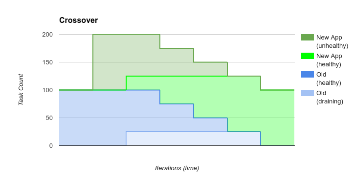
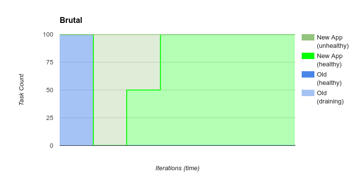
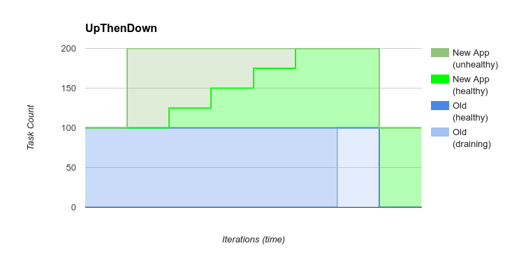
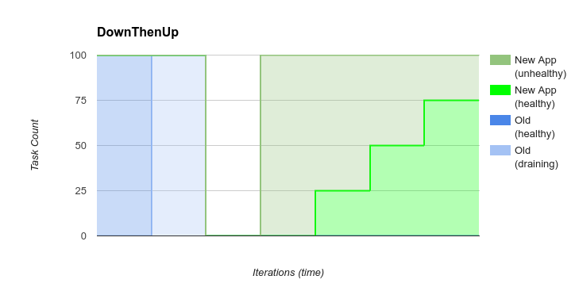

How PaaSTA Bounces New Code and SOA-config changes
==================================================

In the context of this document, "Bouncing" refers to the procedure of
replacing old tasks with new ones. With long-running services bouncing
is implemented by controlling Marathon Apps. For periodic tasks, see the
section on "Chronos Bouncing."

A "Bounce" can happen for one of these reasons:

* A new version of the code is deployed (a git sha change)
* A change of `soa-configs <yelpsoa_configs.html>`_ for a service. (Change in ram, cpu, environment variables, etc)

  * With the exception of these keys:

    * ``min_instances``
    * ``instances``
    * ``max_instances``
    * ``backoff_seconds``

* An issue of a ``paasta restart`` (or partially from a start/stop)
* A change in system-wide PaaSTA configuration (defaults for volumes, ram, cpu, etc)

By default, PaaSTA will do the safest thing possible and favors service uptime
over speed. Read further for the actual details of this default procedure in the
``crossover`` bounce.

If service uptime is irrelevant then the ``brutal`` bounce can be selected.

The ``upthendown`` and ``downthenup`` provide for other use cases where more
predictable bouncing behavior is desired.

Read more in the next section for exact details and differences amongst these
bounce method.

Note that only in the case of ``paasta mark-for-deployoment --auto-rollback``
will PaaSTA revert code back to previous versions after a failed
bounce. In any other case, PaaSTA will continue to try to move forward forever
until the bounce proceeds, always trying to converge on the desired state.

Bounce Methods
^^^^^^^^^^^^^^

crossover
"""""""""

The ``crossover`` bounce is the default bounce in PaaSTA. It is the safest
bounce method, as it only removes old tasks after verifying that the new tasks
are alive and healthy. The ``crossover`` bounce can actually protect
infrastructure against bad code, because it won't even proceed if the new
copies of the code are not healthy!

The cost of the ``crossover`` bounce is time. It takes time for new tasks to be
healthy, and the ``crossover`` bounce will take as much time as it takes for
the new copies of the service to start up and become healthy, plus the time it
takes to drain and kill the old tasks. In the case of HTTP services using
SmartStack, **no web requests should be lost under normal circumstances**.

brutal
""""""

.. warning:: The ``brutal`` bounce is NOT safe, and performs NO healthchecks before proceeding. Do NOT use this bounce method on a production service!

The ``brutal`` bounce replaces old tasks with new tasks with no regards to
safety. It launches new tasks immediately and kills old tasks immediately
without draining them.

The ``brutal`` bounce is probably best for apps that don't have safety concerns
and want the fastest bounce possible.

**Note1**: Services *will* incur downtime during the ``brutal`` bounce and
there is no protection against unhealthy services. You can relax the monitoring
to account for this::

    main:
      bounce_method: 'brutal'
      # Relax the monitoring because it will be down during the bounce
      # things are going to be down and we don't care
      monitoring:
        alert_after: 20m

upthendown
""""""""""

The ``upthendown`` bounce will wait till there is a full healthy copy of a new
app before draining and gracefully killing the old one.

This bounce takes the longest and requires 2X the normal resources for a
service at peak.

Choose this bounce method with care, as it will refuse to proceed until the new
app is fully deployed and healthy, which may not be possible with large apps
combined with a limited cluster size.

**Note**: This is deprecated on kubernetes.

downthenup
""""""""""

.. warning:: The ``downthenup`` bounce is NOT safe, and performs NO healthchecks before proceeding. Do NOT use this bounce method on a production service!

The ``downthenup`` bounce will wait until all old copies of a service are gone
before launching any new copies of a service. This bounce method is commonly
used in conjunction with configuration for a single copy of a service, to
ensure only copy is running at a time::

    my_important_batch:
      instances: 1
      # Make sure the old code is down before bringing up the new code
      # to try to make sure only one copy runs at any given time
      bounce_method: 'downthenup'
      # Relax the monitoring because it will be down during the bounce
      # any we only have one copy
      monitoring:
        alert_after: 20m

**Note1**: Using the ``downthenup`` bounce is not a strict guarantee that only
one copy of code will run at a time. If a strict guarantee is needed, use a
stronger locking mechanisms like Zookeeper and don't depend on ``instances: 1``.

**Note2**: Services will incur downtime during the ``downthenup`` bounce and there
is no protection against unhealthy services.

How to Select A Bounce Method
^^^^^^^^^^^^^^^^^^^^^^^^^^^^^

A service author can select a bounce method by setting ``bounce_method`` in
the marathon configuration file. (e.g. ``marathon-SHARED.yaml``) This setting
is set per-instance. If not set, it will default to the ``crossover`` method.
See the docs on the `marathon config <yelpsoa_configs.html#marathon-clustername-yaml>`_ file.

Additionally, a service author can configure how the bounce code determines
which instances are healthy by setting ``bounce_health_params``. This
dictionary is passed in as keyword arguments to `get_happy_tasks <generated/paasta_tools.bounce_lib.html#bounce_lib.get_happy_tasks>`_.
Valid options are:

* ``min_task_uptime``: Minimum number of seconds that a task must be running
  before we consider it healthy. Useful if tasks take a while to start up.
* ``check_haproxy``: Whether to check the local haproxy to make sure this task
  has been registered and discovered.

Understanding How ``bounce_margin_factor`` Affects Bouncing
^^^^^^^^^^^^^^^^^^^^^^^^^^^^^^^^^^^^^^^^^^^^^^^^^^^^^^^^^^^

The ``bounce_margin_factor`` setting in marathon yaml files controls how aggressive the bounce is in the face of failures.
It only applies to the ``crossover`` bounce method.

With the default setting (1.0) the ``crossover`` bounce will begin by draining and killing old copies of the code once new copies are health to replace them.
For example, if ``instances: 10`` and ``bounce_margin_factor: 1.0`` (default), PaaSTA will not begin draining a single copy of the old 10 until at least one new copy of the service is healthy.
If 10 new copies of the service are up, then it will being draining the old 10 copies right away.
If only one new copy of the service comes up, then the bounce will only drain one old copy as it gets replaced.

The ``bounce_margin_factor`` adjusts how aggressive this procedure is.
With the example of ``instances: 10`` and a ``bounce_margin_factor: 0.5`` (50%), then PaaSTA will preemptively being to drain and kill 5 copies of the old service to make room for the next 10 copies.
The setting effectively gives PaaSTA permission to allow the service to dip below the set level of replication for bounce purposes.

The setting is most effective in situations where there are resource constraints.
If the service is small and running in a large pool with plenty of headroom, a ``bounce_margin_factor`` is not necessary.
For a large service in a small pool where there is no headroom, a ``bounce_margin_factor`` is essential, as we need to give PaaSTA permission to make room for the new copies of the service.

Chronos Bouncing
^^^^^^^^^^^^^^^^

In PaaSTA Chronos jobs are simply configured to use new code or config **on the
next execution of the job**. In progress jobs are not adjusted or killed.

Tron Bouncing
^^^^^^^^^^^^^

In PaaSTA Tron jobs are simply configured to use new code or config **on the
next execution of the job**. In progress jobs are not adjusted or killed.
