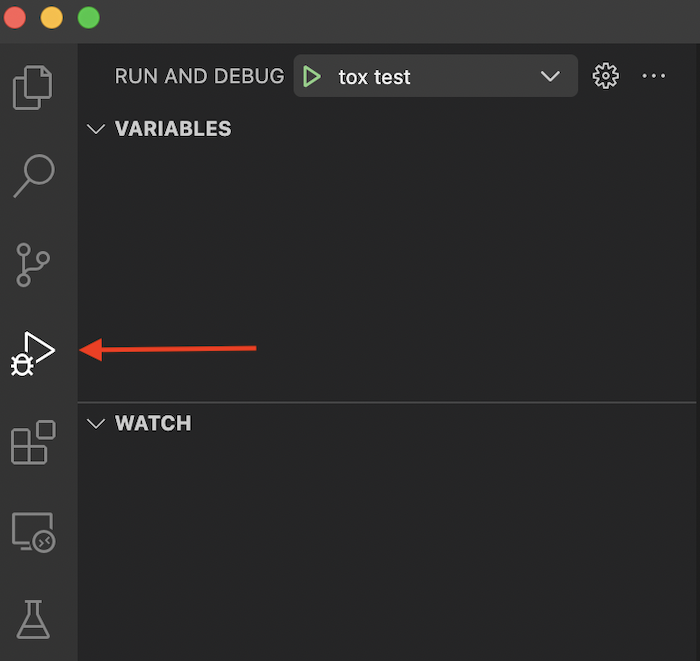
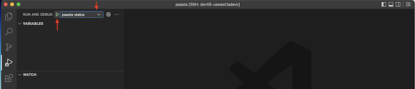

==================
PaaSTA Development
==================

What is the PaaSTA playground?
------------------------------

PaaSTA playground allows the developer to run and debug PaaSTA locally on an ephemeral Kubernetes cluster. Currently, it includes the following components:

* generating ``etc_paasta_playground`` directory (stores system-level PaaSTA configuration)
* generating ``soa_config_playground`` directory (stores what services PaaSTA should manage)
* running setup_kubernetes_job (the tool we use to deploy services on Kubernetes)
* starting the PaaSTA API (the backend that the PaaSTA CLI talks to)
* configuring the PaaSTA CLI (the interface to interacting with PaaSTA)

PaaSTA playground use cases
^^^^^^^^^^^^^^^^^^^^^^^^^^^
There are mainly two use cases for PaaSTA playground:

1) :ref:`If the developer wants to debug different components of PaaSTA <debugging-paasta>`
2) :ref:`If the developer just wants to run PaaSTA to see a change they developed in PaaSTA components <running-paasta>`

Create a Kind Cluster - K8s Cluster
-----------------------------------

Before running or debugging PaaSTA playground, you will need to create a Kubernetes cluster using ``kind``. You can do so by running the Make target
``make k8s_fake_cluster``.

To delete the cluster, run ``make k8s_clean``.

.. _debugging-paasta:

Debugging PaaSTA playground (in VS Code)
----------------------------------------

All components of PaaSTA playground are easy to debug in VS Code by running the debugging configurations in ``launch.json`` file. Before you start
debugging, first run ``make vscode_settings``. This Make target will add debugging settings in ``launch.json`` file.

Below outlines the steps to run the debugger in VS Code and to debug PaaSTA playground components.

.. _running-debugger:

Running the debugger (in VS Code)
^^^^^^^^^^^^^^^^^^^^^^^^^^^^^^^^^

In order to run the debugger with any of the configurations in ``launch.json``, you can go to ``Run and Debug`` tab in VS Code

and select the configuration you want to run the debugger with, then press on ``start debugging`` button

For more information on how to run the VS Code debugger, please refer to `VS Code Documentation <https://code.visualstudio.com/docs/editor/debugging>`_

.. _debugging-paasta-playground:

Debugging PaaSTA playground components (in VS Code)
^^^^^^^^^^^^^^^^^^^^^^^^^^^^^^^^^^^^^^^^^^^^^^^^^^^

Steps below outline running PaaSTA playground components with a debugger attached:

1. Run ``make generate_deployments_for_service`` to run the Make targets that generate the ``etc_paasta_playground`` and ``soa_config_playground`` directories and the ``deployments.json`` file.
2. [This step can be ran one time] From the ``Run and Debug`` tab in VS Code, press on ``Run setup k8s job in playground`` to deploy ``compute-infra-test-service`` service in the cluster, if it's not deployed.

   .. sourcecode:: shell

      (py38-linux) user@dev55-uswest1adevc:~/pg/paasta$ KUBECONFIG=./k8s_itests/kubeconfig kubectl get Pods -n paasta
      NAME                                                      READY   STATUS    RESTARTS   AGE
      compute-infra-test-service-autoscaling-6fdf96b485-2fkd5   1/1     Running   0          25s
      compute-infra-test-service-autoscaling-6fdf96b485-44lqp   1/1     Running   0          25s
      compute-infra-test-service-autoscaling-6fdf96b485-9hvc5   1/1     Running   0          25s
      compute-infra-test-service-autoscaling-6fdf96b485-bdjbw   1/1     Running   0          25s
      compute-infra-test-service-autoscaling-6fdf96b485-hnxlp   1/1     Running   0          25s
      compute-infra-test-service-autoscaling-6fdf96b485-jk6z6   1/1     Running   0          25s
      compute-infra-test-service-autoscaling-6fdf96b485-n9kf4   1/1     Running   0          25s
      compute-infra-test-service-autoscaling-6fdf96b485-nk2mx   1/1     Running   0          25s
      compute-infra-test-service-autoscaling-6fdf96b485-pb6mm   1/1     Running   0          25s
      compute-infra-test-service-autoscaling-6fdf96b485-v8shw   1/1     Running   0          25s

3. From the ``Run and Debug`` tab in VS Code, press on ``paasta API playground`` to run PaaSTA API
4. Wait until workers are booted in API output then from the ``Run and Debug`` tab in VS Code, press on ``paasta status playground`` to run the PaaSTA ClI client to connect to the API.

Observe paaSTA API logs to check for connection from the client.

Expected output from client:

 .. sourcecode:: shell

      compute-infra-test-service.autoscaling in kind-user-k8s-test
          Version:    xxxxxxxx (desired)
          State:      Configured - Desired state: Started
          Kubernetes:   Healthy - up with (10/10) instances (0 evicted). Status: Running
            ReplicaSets:
              ReplicaSet Name                                    Ready / Desired  Created at what localtime         Service git SHA                           Config hash
              compute-infra-test-service-autoscaling-6fdf96b485  10/10            2022-12-14T08:19 (2 minutes ago)  xxxxxxxxxxxxxxxxxxxxxxxxxxxxxxxxxxxxxxxx  configxxxx

.. _running-paasta:

Running PaaSTA playground
-------------------------

There are two ways you can run PaaSTA playground:

If you didn't run ``setup_kubernetes_job`` to deploy ``compute-infra-test-service`` service you can simply run it using ``make setup-kubernetes-job``.

1. Using ``launch.json`` file

   1. From the ``Run and Debug`` tab in VS Code, press on ``PaaSTA playground``. This will run all PaaSTA components.

2. Using make targets

   1. Run ``make setup_kubernetes_job`` to run the Make target that generates the  ``etc_paasta_playground`` and ``soa_config_playground`` directories and ``deployments.json`` file and deploys workloads to the cluster.
   2. Run ``make playground-api`` to run the Make target that runs PaaSTA API.
   3. Wait until workers are booted in API output then from the ``Run and Debug`` tab in VS Code, press on ``paasta status playground`` to run the PaaSTA ClI client to connect to the API.
