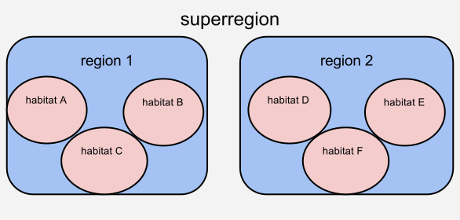
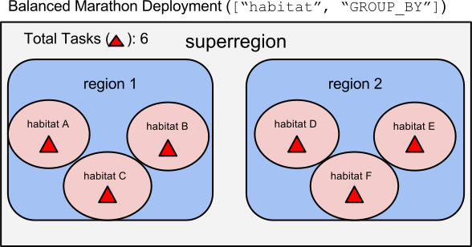
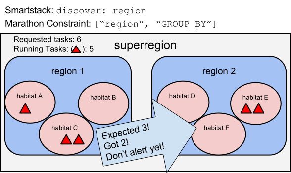

How PaaSTA Interacts with SmartStack
====================================

PaaSTA uses SmartStack configuration to influence the **deployment** and
**monitoring** of services. This document assumes some prior knowledge
about SmartStack; see http://y/smartstack.

How SmartStack Settings Influence Deployment
--------------------------------------------

In SmartStack, a service can be configured to be *discovered* at a particular
latency zone.

At Yelp, we give names to these latency zones like this:

The ``discover:`` key in smartstack sets the scope at which individual
tasks can be discovered and load balanced to. For example, a setting
of ``discover: superregion`` would discover one large pool of tasks for
use, regardless of which region or habitat they are in. (great for availability)
e.g. A service in habitat A will make requests of a service in any of habitats
A-F. This is great for availability -- six habitats to try -- but may introduce
latency if communications are slow between region 1 and region 2.

As another example, a setting of ``discover: habitat`` would make it so only
the tasks in a particular habitat are discover-able by the clients in that
habitat. (great for latency)
e.g. A service in habitat A will make requests of a service only in habitats
A-C. This is great for latency -- only talk to habitats that are
topographically "nearby" -- but reduces availability since only three habitats
can be reached.

What Would Happen if PaaSTA Were Not Aware of SmartStack
^^^^^^^^^^^^^^^^^^^^^^^^^^^^^^^^^^^^^^^^^^^^^^^^^^^^^^^^

PaaSTA uses `Marathon <https://mesosphere.github.io/marathon/>`_ to deploy
long-running services. At Yelp, PaaSTA clusters are deployed at the
``superregion`` level. This means that a service could potentially be deployed
on any available host in that ``superregion`` that has resources to run it. If
PaaSTA were unaware of the Smartstack ``discover:`` settings, Marathon would
naively deploy tasks in a potentially "unbalanced" manner:

.. image:: unbalanced_distribution.svg
   :width: 700px

With the naive approach, there is a total of six tasks for the superregion, but
four landed in ``region 1``, and two landed in ``region 2``. If
the ``discover`` setting were set to ``habitat``, there would be habitats
**without** tasks available to serve anything, likely causing an outage.

In a world with configurable SmartStack discovery settings, the deployment
system (Marathon) must be aware of these and deploy accordingly.

What A SmartStack-Aware Deployment Looks Like
^^^^^^^^^^^^^^^^^^^^^^^^^^^^^^^^^^^^^^^^^^^^^

By taking advantage of
`Marathon Constraint Language <https://mesosphere.github.io/marathon/docs/constraints.html>`_
, specifically the
`GROUP_BY <https://mesosphere.github.io/marathon/docs/constraints.html#group_by-operator>`_
operator, Marathon can deploy tasks in such a way as to ensure a balanced number
of tasks in each latency zone.

Example: Balanced deployment to every habitat
*********************************************

For example, if the SmartStack setting
were ``discover: habitat`` [1]_, we Marathon could enforce the constraint
``["habitat", "GROUP_BY"]``, which will ask Marathon to distribute tasks
evenly between the habitats[2]_:

Example: Deployment balanced to each region
*******************************************

Similarly, if the ``discover`` setting were set to ``region``, the equivalent
Marathon constraint would ensure an equal number of tasks distributed to each region.

.. image:: balanced_distribution_region.svg
   :width: 700px

Even though there some habitats in this diagram that lack the service, the
``discover: region`` setting allows clients to utilize *any* process as long
as it is in the local region. The Marathon constraint of ``["region", "GROUP_BY"]``
ensures that tasks are distributed equally over the regions, in this case three
in each.

.. [1] Technically PaaSTA should be using the smallest value of the ``advertise``
   setting, tracked in `PAASTA-1253 <https://jira.yelpcorp.com/browse/PAASTA-1253>`_.
.. [2] Currently the ``instances:`` count represents the total number of
   instances in the cluster. Eventually with `PAASTA-1254  <https://jira.yelpcorp.com/browse/PAASTA-1254>`_
   the instance count will be a per-discovery-location setting, meaning there
   will always be an equal number of instances per location. (With ``instances: 6``
   and a ``discovery: habitat``, and three habitats, the total task count would be
   18, 6 in each habitat.)

How SmartStack Settings Influence Monitoring
--------------------------------------------

If a service is in SmartStack, PaaSTA uses the same ``discover`` setting
referenced above inform how the service should be monitored. When a service
author sets a particular setting, say ``discover: region``, it implies that the
system should enforce availability of that service in every region. If there
are regions that lack tasks to serve that service, then PaaSTA should alert.

Example: Checking Each Habitat When 'discover: habitat'
^^^^^^^^^^^^^^^^^^^^^^^^^^^^^^^^^^^^^^^^^^^^^^^^^^^^^^^

If SmartStack were configured to ``discover: habitat``, PaaSTA would configure
Marathon to balance tasks to each habitat. But what if it was unable to do that?

Let's look at a particular example:

.. image:: replication_alert_habitat.svg
   :width: 700px

In this case, there are no tasks in habitat F. This is a problem because the
``discover: habiat`` implies that any clients in that habitat (F) will not
be able to find this service. It is *down* in habitat F.

To detect and alert on this, PaaSTA iterates through each unique location of
the type set by the ``discover`` setting. In this case, ``habitat``. The PaaSTA
replication check iterated through habitats A-F, found at least one habitat
that did not have enough replication (0 out of 1), and would have alerted.

The output of the alert or ``paasta status`` would look something like this::

    Smartstack:
        habitatA - Healthy - in haproxy with (1/1) total backends UP in this namespace.
        habitatB - Healthy - in haproxy with (1/1) total backends UP in this namespace.
        habitatC - Healthy - in haproxy with (1/1) total backends UP in this namespace.
        habitatD - Healthy - in haproxy with (1/1) total backends UP in this namespace.
        habitatE - Healthy - in haproxy with (1/1) total backends UP in this namespace.
        habitatF - Critical - in haproxy with (0/1) total backends UP in this namespace.

In this case the service author may have a few actions they can take:

# Increase the total instance count to have more tasks per habitat. (one task in each habitat is a single point of failure in this example)
# Change the ``discovery`` setting to ``region`` to increase availability at the cost of latency.
# Investigate *why* tasks can't run in habitat F. (Lack of resources? Improper configs? Missing service dependencies?)

Example: Checking Each Region When ``discover: region``
^^^^^^^^^^^^^^^^^^^^^^^^^^^^^^^^^^^^^^^^^^^^^^^^^^^^^^^

If SmartStack were configured to ``discover: region``, PaaSTA would configure
Marathon to balance tasks to each region. But what if it was unable to launch
all the tasks, but there were still tasks running in that region?

Let's look at a particular example:

The output of the alert or ``paasta status`` would look something like this::

    Smartstack:
        region1 - Healthy - in haproxy with (3/3) total backends UP in this namespace.
        region2 - Warning - in haproxy with (2/3) total backends UP in this namespace.

Assuming a threshold of 50%, and alert would not be sent to the team in this case.
Even though there are habitats that do not have tasks for this service, the
``discover: region`` setting ensures that any client can be satisfied as long as there
are tasks in the same region, even if they are in different habitats.

Addendum: Non-Smartstack Monitoring
***********************************

If a service is not in SmartStack, then our monitoring requirements are greatly
simplified. PaaSTA simply looks at the number of tasks that are running and
compares it against the requested requested task count. If the running task
count is under the configured percentage threshold (defaults to 50%) then an
alert will be sent. No consideration for the distribution of the tasks among
latency zones (habitats, regions, etc) is taken into account.
